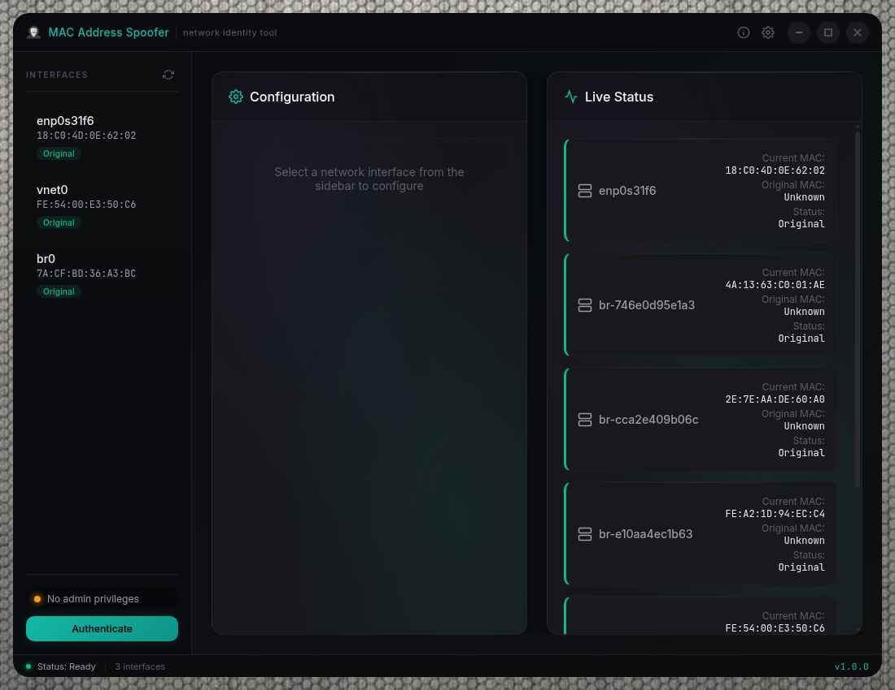

# MAC Spoofer - Network Interface Manager

> Cross-platform MAC address spoofing utility with dark mode GUI and Python backend


<p align="center">
  
</p>

A professional cross-platform desktop application for secure MAC address spoofing with an intuitive dark mode interface.

## 🚀 Quick Start

### For End Users - Download Binaries
1. **Download** for your platform from the `dist/` folder:
   - **macOS**: `MAC Address Spoofer-1.0.0-mac.zip` (Intel) or `MAC Address Spoofer-1.0.0-arm64-mac.zip` (Apple Silicon)
   - **Windows**: `MAC Address Spoofer-1.0.0-win.zip` (portable)
   - **Linux**: `MAC Address Spoofer-1.0.0.AppImage` (universal)

2. **Run** the application from source:
   ```bash
   # macOS
   ./scripts/run-macos-source.sh

   # Windows
   scripts/run-windows-source.bat

   # Linux
   ./scripts/run-linux-source.sh
   ```

### For Developers - Run from Source
1. **Install Dependencies**
   ```bash
   npm install
   ```

2. **Run from Source**
   ```bash
   # macOS
   ./scripts/run-macos-source.sh
   
   # Windows
   ./scripts/run-windows-source.bat
   
   # Linux
   ./scripts/run-linux-source.sh
   ```

3. **Build All Platforms**
   ```bash
   ./scripts/compile-build-dist.sh
   ```

### Prerequisites
- **Runtime**: Node.js 16+, Python 3.x
- **Permissions**: Administrator/sudo privileges for MAC operations
- **Platforms**: macOS 10.15+, Windows 10+, Linux (major distributions)

## 🌟 Features

### Core Functionality
- **Cross-Platform GUI**: Modern Electron app for Windows, macOS, and Linux
- **Dark Mode Interface**: Professional dark theme with smooth animations
- **Real-Time Interface Detection**: Automatically discovers network interfaces
- **Safe MAC Generation**: Creates locally administered MAC addresses
- **Original MAC Backup**: Automatic backup and restore functionality
- **Admin Privilege Detection**: Checks for required administrator privileges
- **Live Status Monitoring**: Real-time interface status updates

### User Experience
- **Intuitive Interface**: Clean, modern UI with clear visual feedback
- **Toast Notifications**: Non-intrusive success/error notifications
- **Loading States**: Professional loading indicators and progress feedback
- **Responsive Design**: Works on various screen sizes
- **Keyboard Navigation**: Full keyboard accessibility support

### Main Interface Panels
1. **Network Interfaces Panel** - Lists all available network interfaces with current MAC addresses and status indicators
2. **MAC Address Controls Panel** - Radio button selection, random MAC generation, custom MAC input with validation
3. **Interface Status Panel** - Grid view of all interfaces with current vs. original MAC comparison

## 🔧 Development & Building

### Development Mode
```bash
npm run dev
```
Opens with developer tools for debugging.

### Build Commands

```bash
# Development
npm start              # Run in development mode
npm run dev           # Run with dev tools

# Building
npm run build         # Build for current platform
npm run build:win     # Build for Windows (.exe, .msi)
npm run build:mac     # Build for macOS (.dmg)
npm run build:linux   # Build for Linux (.AppImage)
npm run build:all     # Build for all platforms
```

### Automated Build Script
```bash
./build-scripts/build-all.sh
```

## 🏗️ Architecture

### Application Structure
```
src/
├── main.js         # Electron main process
├── preload.js      # Secure IPC bridge
├── index.html      # Application UI
├── styles.css      # Dark mode styling
└── app.js          # Frontend application logic
```

### Key Components

**Main Process (`main.js`)**
- Window management and application lifecycle
- Python script execution and process management
- IPC handlers for all UI operations
- Cross-platform file path resolution

**Preload Script (`preload.js`)**
- Secure bridge between main and renderer processes
- Exposes safe APIs to the frontend
- MAC address validation utilities
- Random MAC generation functions

**Renderer Process (`app.js`)**
- User interface management and event handling
- Interface selection and status display
- MAC spoofing operations and feedback
- Toast notifications and loading states

**Python Bridge**
- Executes the existing `universal_mac_spoof.py` script
- Handles command-line argument formatting
- Parses Python script output for UI display
- Manages subprocess communication

## 🔒 Security & Privileges

### Required Privileges
- **Windows**: Run as Administrator
- **macOS**: sudo access required
- **Linux**: sudo access required

### Admin Detection
The app automatically detects if you have the required privileges and shows:
- ✅ Green indicator: Admin privileges available
- ⚠️ Yellow indicator: No admin privileges (warning shown)

### Security Features
- Automatic admin privilege detection
- MAC address format validation
- Interface name sanitization
- Safe command construction
- Secure IPC communication
- Context isolation enabled
- Node integration disabled in renderer

## ⚙️ How It Works

### Workflow
1. App loads and detects network interfaces
2. User selects an interface from the list
3. Choose MAC type (random or custom)
4. Click "Spoof MAC Address"
5. Python script executes with sudo/admin privileges
6. UI updates with success/error feedback
7. Status panel shows current vs. original MACs

### Cross-Platform Implementation
- **Windows**: Uses PowerShell and netsh commands
- **macOS**: Uses ifconfig with sudo access
- **Linux**: Uses ip command (falls back to ifconfig)

## 🎯 Usage Tips & Troubleshooting

### First Time Setup
1. Make sure Python 3 is installed and accessible
2. Run the app as Administrator/sudo
3. Check the admin status indicator in the header
4. Select a network interface to begin

### Best Practices
- Always test on non-critical network interfaces first
- Keep the original MAC addresses noted down separately
- Network connection may briefly disconnect during spoofing
- Some network adapters don't support MAC spoofing

### Common Issues

1. **"No Admin Privileges" Warning**
   - Restart the application as Administrator/sudo
   - Check user account permissions

2. **Interface Not Found**
   - Click refresh to reload interface list
   - Verify Python script has proper permissions

3. **MAC Spoofing Failed**
   - Ensure administrator privileges
   - Check if network adapter supports MAC spoofing
   - Try different network interfaces

4. **App Won't Start**
   - Reinstall dependencies with `npm install`
   - Verify Python 3 installation and PATH

## 📱 Distribution Files

**Windows**
- `MAC-Address-Spoofer-Setup-1.0.0.exe` (NSIS installer)
- Requires Windows 10+ and Administrator privileges

**macOS**
- `MAC-Address-Spoofer-1.0.0.dmg` (disk image)
- Requires macOS 10.14+ and sudo access

**Linux**
- `MAC-Address-Spoofer-1.0.0.AppImage` (portable)
- Requires glibc 2.28+ and sudo access

## 📋 Configuration

### Project Structure
```
MAC_Spoofer/
├── src/                    # Electron application source
├── assets/                 # Application icons and resources
├── build-scripts/          # Build automation scripts
├── universal_mac_spoof.py  # Original Python utility
├── package.json           # Node.js dependencies and scripts
└── README.md              # This documentation
```

### Window Configuration
- Default size: 1000x700 pixels
- Minimum size: 800x600 pixels
- Dark theme background
- Hidden title bar on macOS
- Context isolation and security settings

## 🌟 Advanced Features & Customization

### Customization Options
- Modify `src/styles.css` for theme changes
- Update `src/app.js` for UI behavior
- Edit `src/main.js` for backend functionality

### Potential Enhancements
- Add MAC address history/favorites
- Implement scheduling for automatic spoofing
- Add network profile management
- Create backup/restore functionality
- Add auto-updater functionality

## 🚀 Deployment

### Development Deployment
1. Run `npm install` to install dependencies
2. Use `npm start` for immediate testing
3. Test all MAC spoofing operations with admin privileges

### Production Deployment
1. Run the build script: `./build-scripts/build-all.sh`
2. Test the built application on target platforms
3. Distribute the installer/package files
4. Include installation instructions for admin privileges

---

**Enjoy your new MAC Address Spoofer GUI!** 🎉

The combination of your solid Python utility with a modern Electron interface gives you the best of both worlds - powerful functionality with an intuitive user experience.