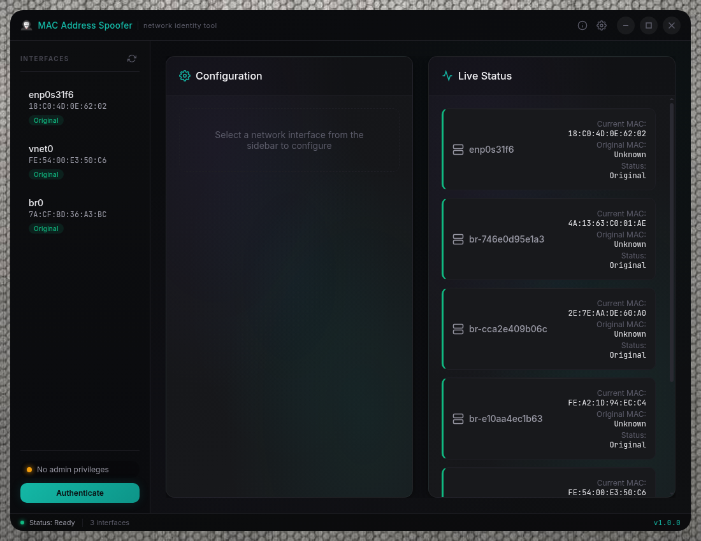

# MAC Address Spoofer

Cross-platform MAC address spoofing utility — frameless Electron desktop app with a Python backend.


<p align="center">
  
</p>

A desktop application for changing network interface MAC addresses. The UI is a Neo-Noir Glass Monitor floating frameless window (1100x850, no title bar). The backend is a Python script that runs platform-specific system commands with elevated privileges.

## Quick Start

### Download a Binary

Download for your platform from [Releases](https://github.com/sanchez314c/mac-spoofer/releases):

- macOS Intel: `MAC-Address-Spoofer-1.2.2.dmg`
- macOS Apple Silicon: `MAC-Address-Spoofer-1.2.2-arm64.dmg`
- Windows x64: `MAC-Address-Spoofer-Setup-1.2.2.exe`
- Linux x64: `MAC-Address-Spoofer-1.2.2.AppImage`

### Run from Source

```bash
git clone https://github.com/sanchez314c/mac-spoofer.git
cd mac-spoofer
npm install
npm start
```

Prerequisites: Node.js 22 (see `.nvmrc`), Python 3.8+.

### Run Scripts

```bash
# macOS
./scripts/run-macos-source.sh

# Windows
scripts/run-windows-source.bat

# Linux
./scripts/run-linux-source.sh
```

## Features

- Detects all network interfaces and their current MAC addresses
- Random MAC generation: first octet is `02`, `06`, `0A`, or `0E` (locally administered unicast)
- Custom MAC input with format validation (`/^([0-9A-Fa-f]{2}[:-]){5}([0-9A-Fa-f]{2})$/`)
- One-click restore to the original MAC
- Admin privilege detection with platform-specific escalation flow
- Toast notifications and loading overlay
- Frameless transparent window — drag region on title bar, IPC-controlled minimize/maximize/close

## Architecture

Three-layer stack: renderer process (HTML/CSS/vanilla JS) communicates with the main process via `contextBridge` IPC, which spawns the Python backend as a subprocess.

```
Renderer (src/app.js + src/index.html)
  window.electronAPI.*
  ipcRenderer.invoke()
Main Process (src/main.js)
  ipcMain.handle() × 12 channels
  child_process.spawn(python, [script, ...args])
Python Backend (src/universal_mac_spoof.py)
  macOS: ifconfig + networksetup
  Linux: ip link / ifconfig hw ether
  Windows: PowerShell Set-NetAdapter
```

Key security constraints: `nodeIntegration: false`, `contextIsolation: true`, `experimentalFeatures` intentionally absent (its presence silently breaks `contextBridge.invoke()` on Linux).

## Build

```bash
./scripts/compile-build-dist.sh
```

Or platform-specific:

```bash
npm run build        # current platform
npm run build:mac    # macOS (dmg + zip + pkg, x64 + arm64 + universal)
npm run build:win    # Windows (nsis + msi + zip + portable, x64 + ia32)
npm run build:linux  # Linux (AppImage + deb + rpm + snap + tar, x64 + arm64 + armv7l)
```

## Repository

```
src/
├── main.js                  # Electron main process, BrowserWindow, IPC handlers
├── preload.js               # contextBridge: 12 IPC methods + 3 sync utilities
├── app.js                   # Renderer: MACSpooferUI class
├── auth-handler.js          # AuthHandler: osascript / PowerShell RunAs / pkexec chain
├── index.html               # App shell: title bar, sidebar, config panel, status panel
├── theme.css                # Design tokens (150 CSS custom properties)
├── styles.css               # Component styles
└── universal_mac_spoof.py   # MACSpoofer class: platform detection, spoof/restore/log
scripts/
├── compile-build-dist.sh    # Master build orchestrator
├── bloat-check.sh           # Dependency size analysis
└── temp-cleanup.sh          # Build artifact cleanup
docs/                        # Full documentation (see docs/README.md)
```

## Documentation

Full docs are in `docs/`. Start with [docs/README.md](docs/README.md) for an index.

## License

MIT. Copyright 2026 Jason Paul Michaels. See [LICENSE](LICENSE).

## Contributing

See [CONTRIBUTING.md](CONTRIBUTING.md) for code standards, PR process, and security requirements.
